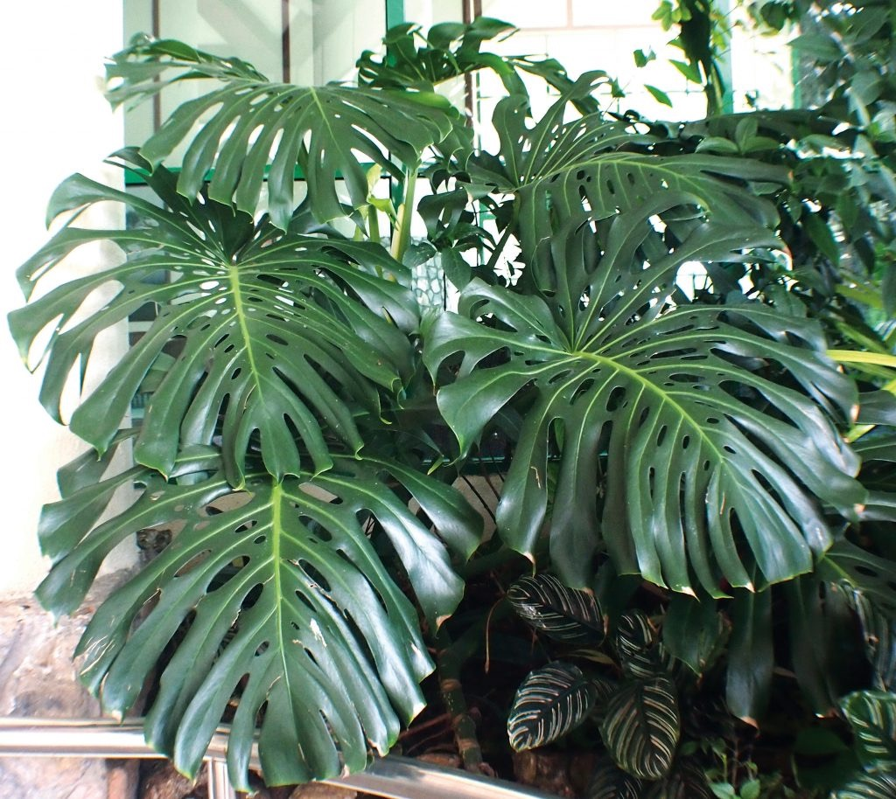




# 天南星科中文站
 ***Aroido.net*** 准备建设华语圈的天南星科站点，未来将发现和记录天南星科植物的种类，也会组织其他活动，更希望出版中文内容的植物介绍。

<!--more-->
天南星科 ***Araceae*** 是一个单子叶开花植物科，其花生在一种叫做穗状花序的花序上。穗状花序通常伴随着佛焰苞（或像叶子一样的苞片），有时也部分地封闭在佛焰苞中。也被称为 ***arum family*** ，其成员通常被俗称为 ***aroids*** 。该科有140个属，约4,075个已知种，在新大陆热带地区最为多样，但也分布在旧世界热带地区和北温带地区。


 **本网站还处于筹备建设中，欢迎有志之士一起加入。** 









